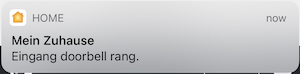
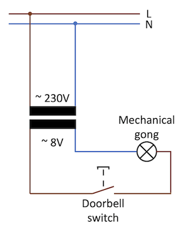
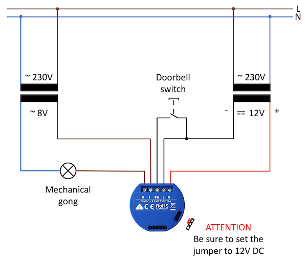
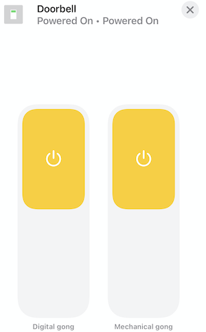

# Homebridge Shelly Doorbell Plugin

This Homebridge plugin, together with a [Shelly 1](https://shelly.cloud/products/shelly-1-smart-home-automation-relay/), can turn any old-fashioned two-wire doorbell into a HomeKit-compatible digital doorbell.

 

That means you can get a push notification when someone rings your doorbell and it doesn't matter if you are at home or on the road. You can also turn your doorbell on and off via HomeKit. This enables you to integrate the doorbell into numerous automations, e.g. to turn off the doorbell automatically in the evening or to turn on a light when someone has rung the bell.

**Requirements**  

* Shelly 1 (12 EUR)  
* 12V DC Driver (12 EUR)  
* Some wires and clamps
* Running Homebridge with this plugin installed
* **If you are not qualified and licensed to do electrical work, you will need an electrician to help you.**

# Supported old fashion doorbell with two wires

If your existing doorbell is installed and switched like this, you can make it "smart" with this plugin and a Shelly 1:

  

**Note:** Shelly 1 supports a lot of voltages with both AC and DC on the relay, so even if your mechanical gong works with different voltages, there is a high chance that your environment is compatible with this plugin.

# Hardware (Shelly 1) installation

Das besondere an diesem Setup ist, dass der Shelly 1 mit 12V DC betrieben wird, damit wir ihn mit der Türklingel verbinden können.



# Shelly 1 pre-configuration

The plugin sets the "Button Type" of the Shelly 1 to "Activation Switch". Thereby every short press of the doorbell activates the relay for a certain time so that the gong sounds completely. Under Timer -> AUTO OFF you should set a value in seconds, how long the gong should ring until the relay switches off again. For us, the value "0.3 has turned out to be a reasonable duration.

To trigger a digital gong you have to check "Enabled" on the Shelly under "I/O URL actions" -> "BUTTON SWITCHED ON URL" and set the url to the address of the Homebridge with the port of the plugin:

```
http://<homebridge-ip>:<shelly-doorbell-http-port>/ 
http://192.168.0.100:9053/
```


# Plugin configuration

```javascript
{
    "name": "Shelly 1-Doorbells",
    "doorbells": [
        {
            "shelly1IP": "192.168.0.100",
            "digitalDoorbellWebhookPort": 9053
        }
    ],
    "platform": "ShellyDoorbell"
}
```


| Setting | Example | Description |
| --- | --- | --- |
| name | Doorbell | Name of the doorbell |
| shelly1IP*  | 192.168.0.100 | IP of Shelly 1 |
| digitalDoorbellWebhookPort*  | 9053 | HTTP Port for the digital doorbell trigger server |
| mechanicalDoorbellName  | Mechanical gong | What is connected to the relay (slots I and O) of your Shelly? |
| digitalDoorbellName  | Digital gong | Name for the digital doorbell |

\* Mandatory field.

# Doorbell controls

Please reboot homebridge after setup is completed. Now you should see the doorbell in your default room. On the left side you can enable or disable the "digital gong" (Push Notifications, HomePod ringing, Automations,...).
On the right side you can enable and disable your "mechanical gong". Both names can be changed via the configuration.

  

**Note:** Both switches work independently from each other.

# Enjoy your smart doorbell 🚪🛎👍


